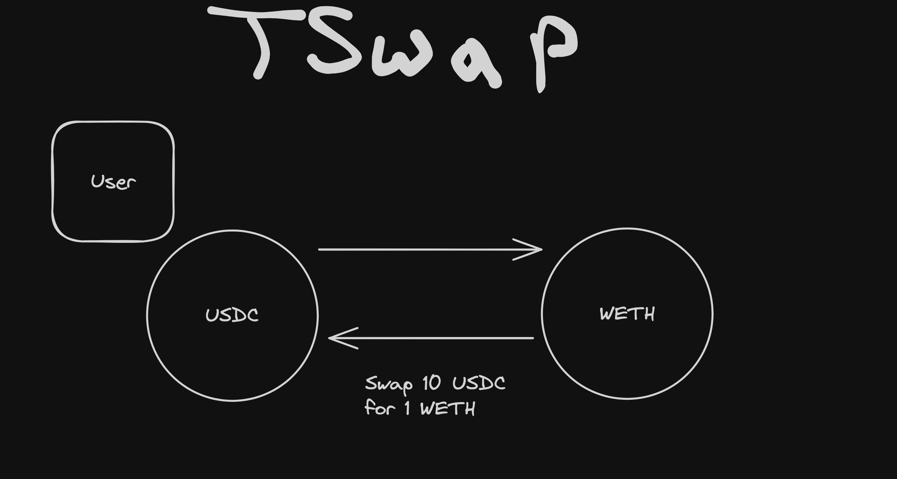
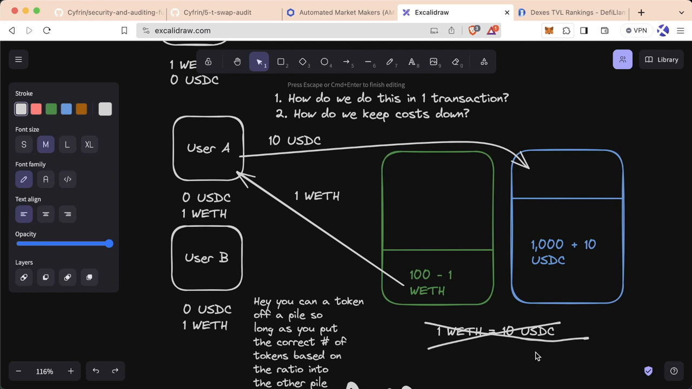
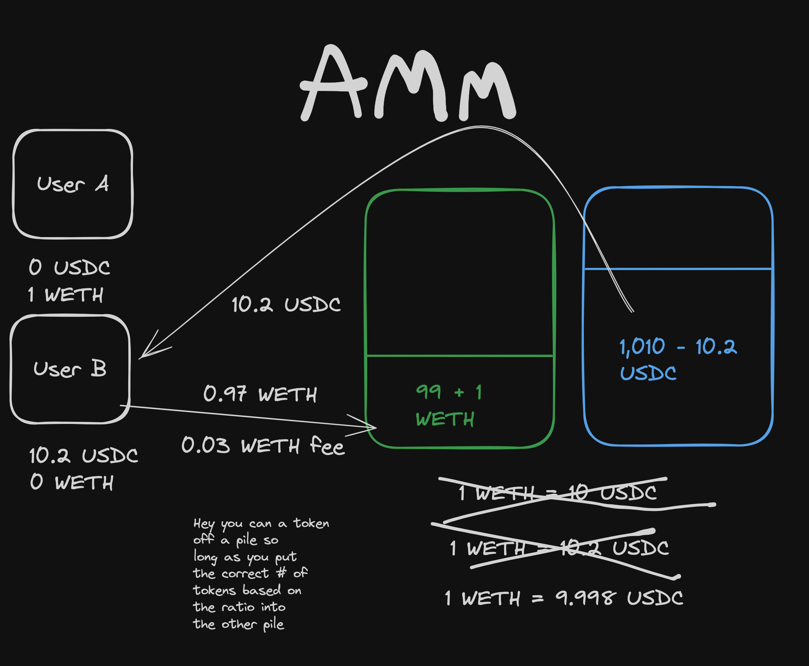

# TSwap

- Tswap is v1 of uniswap
- It is a DEX(Decentralized Exchange)
- This project is meant to be a permissionless way for users to swap assets between each other at a fair price. You can think of T-Swap as a decentralized asset/token exchange (DEX). 

- A user has 10 USDC and this user wants to sell 10 USDC to buy 1 WETH
- Now this user has 0 USDC and 1 WETH

- T-Swap is known as an [Automated Market Maker (AMM)](https://chain.link/education-hub/what-is-an-automated-market-maker-amm) because it doesn't use a normal "order book" style exchange, instead it uses "Pools" of an asset. 
- It is similar to Uniswap. To understand Uniswap, please watch this video: [Uniswap Explained](https://www.youtube.com/watch?v=DLu35sIqVTM)

## Order Book Style Exchange

.png)

- UserA will come to the exchange and say I want 1 WETH for 10 USDC
- This trade will be placed on the order book
- Let's say UserB wants to take that trade
- UserB will place the trade of 1 WETH for 10 USDC 
- Order book will give 1 WETH to userA and give 10 USDC to UserB
- This order book style of trading is good for web2
- But when we try the same approach on Ethereum chain
- UserA has to place a transaction
- UserB has to place a transaction
- They both have to spend some gas
- Order book has to do some computations
- This could get expensive

## AMM (Automated Market Maker)

- Rather than placing orders and matching them as in an order book exchange, an AMM operates on the principle of liquidity pools.
- Let's visualize this using an example:
  - Assume two giant pools of money or 'liquidity pools' exist — one with `100 WETH` and the other with `1000 USDC`.
  - The ratio between them is `1:10`
  - Which means `1 WETH == 10 USDC` 
  - `User A` wishes to buy `1 WETH` with his `10 USDC`.

- At this stage, a specific mathematical function comes into play:
  - The system calculates the ratio of WETH to USDC in the pools which is 1000 USDC / 100 WETH = 10.
  - So, the 'mock price,' as we are calling it, is 1 WETH = 10 USDC.
  
- Now, if `User A` wants to take `1 WETH` out of the pool, he must ensure the correct ratio is maintained. So he puts `10 USDC` into the USDC pool, and only then can he take out `1 WETH`.

- This alters the ratio in the pools. 
- There are now `1010 USDC` and `99 WETH`. 
- Recalculating, we see the ratio is now `1010/99 = 10.2`. 
- Which means `1 WETH == 10.2 USDC` 
- An increase of 0.2 USDC from the last transaction. By simply completing the transaction, 
- User A has managed to move the market and change the price of WETH. 
- This essentially resembles market dynamics breath the concept of supply and demand; as demand for an asset increases, so does its price, and vice versa.
- Initially it had 100 WETH
- Now it has only 99 WETH
- Which means there is a demand for WETH if it continued on

- This same principle applies when User B wants to trade. 
- `UserB` wants trade `1 WETH`
- `1 WETH == 10.2 USDC`
- Therfore `UserB` will get `10.2 USDC`
- Poll reservoirs will get updated
- `WETH` pool will have `100 WETH`
- `USDC` pool will have `999.8 USDC`
- Therfore `1 WETH == 9.998 USDC`

  
- They can keep changing the ratios by adding or subtracting amounts in these pools to trade their preferred amount, given that the ratio always is maintained. 
- This AMM model is known as a `constant product market maker`, a type of AMM that maintains a constant product of the quantities of the two assets.
- The following code block presents an example of how this might be implemented programmatically:
- This demonstrates how an AMM operates in a simple and efficient manner, bypassing the traditional challenges of an order book model. But, it is important to remember that this simple example doesn't capture the complexity and potential risks associated with real-world AMMs.
- AMMs are just one aspect of DeFi that is pushing the boundaries of what is possible in finance, allowing individuals to gain control over their financial interactions. However, it’s crucial to understand that, like any financial system, it comes with its own set of risks and challenges. Remember, your capital is always at risk when investing.
- “The fascination of DeFi lies in the infinite possibilities it brings to the world of finance, pushing boundaries and creating opportunities.”

- `IMPORTANT`: Remember, almost all AMMs also extract a small fee for each transaction, say, `0.3%`. So, to trade `1 WETH`, one might actually need to send `1.03 WETH`, with the `0.03` WETH fee either going to its designated spot or staying within the pool.

